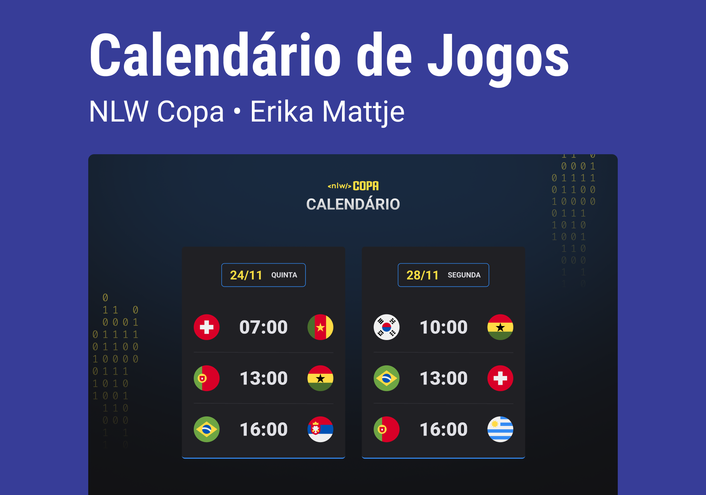

<h1 align="center"> NLW - Copa do Mundo </h1>

Projeto desenvolvido em evento promovido pela Rocketseat.

  <a href="#-tecnologias">Tecnologias</a>&nbsp;&nbsp;&nbsp;|&nbsp;&nbsp;&nbsp;
  <a href="#-projeto">Projeto</a>&nbsp;&nbsp;&nbsp;|&nbsp;&nbsp;&nbsp;
  <a href="#-layout">Layout</a>&nbsp;&nbsp;&nbsp;|&nbsp;&nbsp;&nbsp;
  <a href="#memo-licença">Licença</a>

  

 

  

  

## 🚀 Tecnologias

Esse projeto foi desenvolvido com as seguintes tecnologias:

- HTML e CSS
- JavaScript 
- Git e Github
  

## 💻 Projeto

O calendário da Copa é um projeto que mostra os jogos da Copa em 2022
  
## 🔖 Layout

Você pode visualizar o layout do projeto através [DESSE LINK](https://www.figma.com/file/TTGOYZVrkOyo1MkYGQtzGj/Calend%C3%A1rio-de-Jogos-(Community)?node-id=172%3A179).  
É necessário ter conta no [Figma](https://figma.com) para acessá-lo.
  
## :memo: Licença

Esse projeto está sob a licença MIT.

